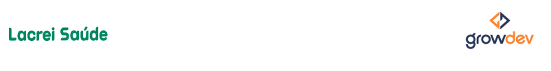

  

## :rocket: Visão Geral
Projeto frontend inspirado no site oficial da **Lacrei Saúde**, desenvolvido durante o **Bootcamp Empresas - GrowDev** para aplicação de conhecimento em **contextos reais com trabalho em equipe**.  

Antes de iniciar o desenvolvimento, foi criado um **wireframe** como guia visual do layout e da estrutura das páginas. Essa etapa permitiu alinhar ideias, organizar os componentes e planejar a responsividade do projeto.  

A plataforma Lacrei Saúde conecta pessoas da comunidade LGBTQIAPN+ com profissionais da saúde qualificados, priorizando **inclusão**, **acolhimento**, **acessibilidade** e **segurança** ([lacreisaude.com.br](https://lacreisaude.com.br/?utm_source=chatgpt.com)).


## :memo: Propósito
- Praticar HTML, CSS e boas práticas de desenvolvimento frontend.
- Implementar componentes como Banner, Sessões “Quem somos”, “Quem nos Apoia”, FAQ, etc.
- Criar uma nova landing page mantendo o padrão de design da marca que já existe e priorizando a semântica e a responsividade.

## :mag: Visão Geral do Projeto
Visite a versão online:  
**https://danieleksantos.github.io/Lacrei-Saude-GrowDev/** 

### Estrutura
Lacrei-Saude-GrowDev/

├── index.html # Página principal com seções principais

├── styles/ # Estilos em CSS

├── assets/images/ # Imagens utilizadas no site

└── README.md # Este arquivo

### Principais Seções 
- **Banner + Formulário de login**: compromisso com inclusão, segurança, acessibilidade e acolhimento.
- **Quem Somos**: missão da plataforma como conexão entre comunidade LGBTQIAPN+ e profissionais da saúde.
- **Encontre profissionais**: passos para cadastro e sinalização de segurança da plataforma.
- **Apoiadores**: logos de instituições parceiras (GitHub, Microsoft, Sebrae, AstraZeneca etc.).
- **FAQ**: perguntas frequentes sobre inclusão clínica, cadastro, busca e serviços.

## :bulb: Tecnologias Usadas
- HTML semântico
- CSS
- Layout responsivo (mobile-first)

## :gear: Como Rodar Localmente
1. Clone o repositório:

   ```bash
   git clone https://github.com/danieleksantos/Lacrei-Saude-GrowDev.git
   cd Lacrei-Saude-GrowDev```

2. Abra o arquivo index.html no navegador.

## :closed_book: Sobre a Empresa — Lacrei Saúde

Missão: Proporcionar inclusão da comunidade LGBTQIAPN+ ao atendimento clínico.

Visão: Ser a plataforma de serviços de saúde para a comunidade LGBTQIAPN+ no Brasil.

Valores: Representatividade, segurança e acessibilidade.

Como funciona: Cadastro gratuito, busca por critérios (especialidade, sintomas, etnia, gênero), validação por SMS e contato seguro com profissionais.

## :heart: Contribuições

Contribuições são bem-vindas! Sinta-se à vontade para:

- Abrir issues com sugestões ou correções

- Fazer fork e enviar pull requests com melhorias (responsividade, acessibilidade, estilo, conteúdo)


Agradecimentos

Ao time GrowDev e à Lacrei Saúde por viabilizar ambiente seguro de estudo e inspirar este projeto com sua missão de inclusão e acolhimento.
